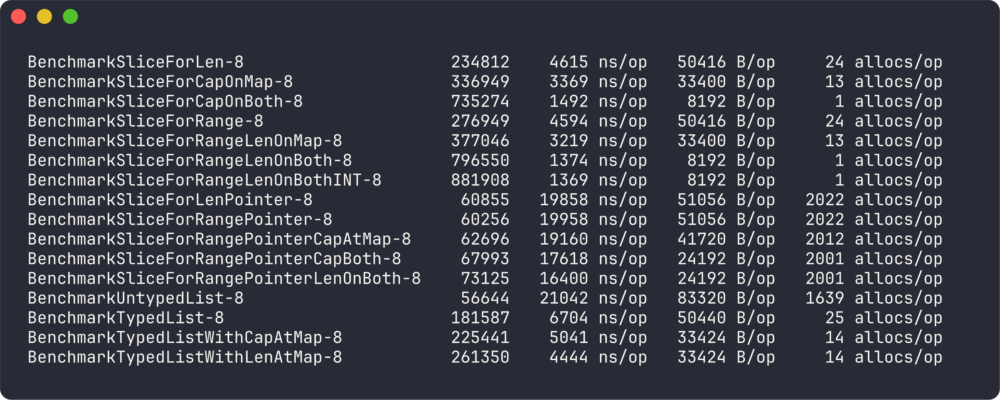
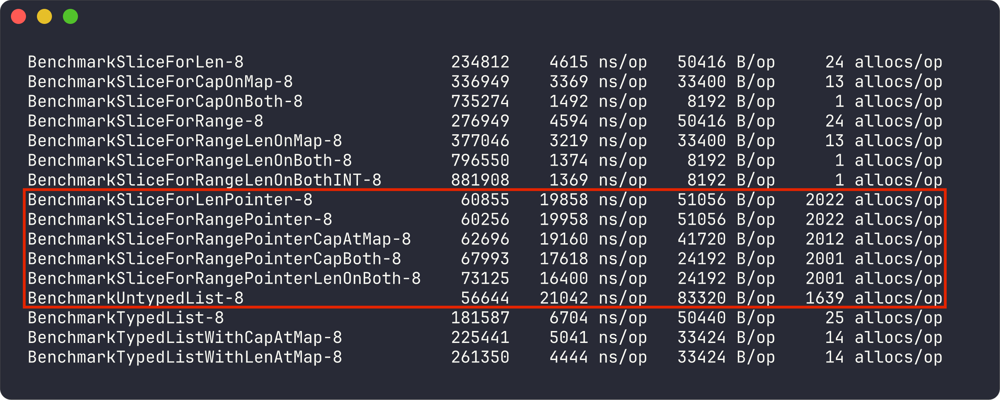
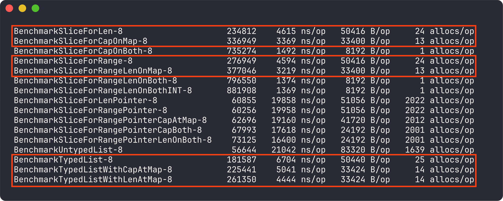
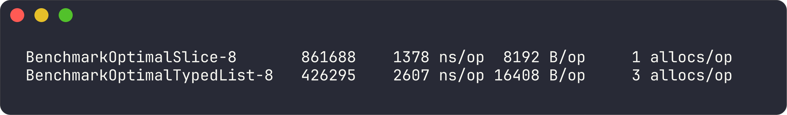
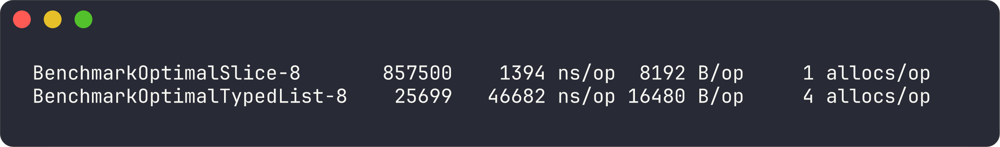

# Kata Presenation

## Benchmarks

I started with a benchmark for the `.Map` functionality, to determine which is the most effective way to create a list and map through it.

The Benchmark will add 1000 entries (an object with one integer value) to a list, .Map to a new list with a function that multiplies the value of the object by 2, and check the value.

### Conclusions

The untyped list solution in [this file](./src/list/untyped_list.go), has similar performance profiles as the native solution with pointers, however, it still uses a quarter less allocations as direct pointers.

When I use cap or len on the slices, there are around 12 allocations less per slice, because go has to extend the slice on demand when `append` is called.

A last test, was an optimal setup, where the native and the typed list implementation both have the initial len aswell as the len on `.Map` applied.

These benchmarks were done before any lock mechanism was implemented, this is the result after implementing lock:

Maybe I did something wrong, but I received a huge performance loss (around 18 times worse) after that. Currently using `Rlock` on every read operation like `.Get` and `.Lock` on any `.Set`, `.Map` and `.Add` operation.
